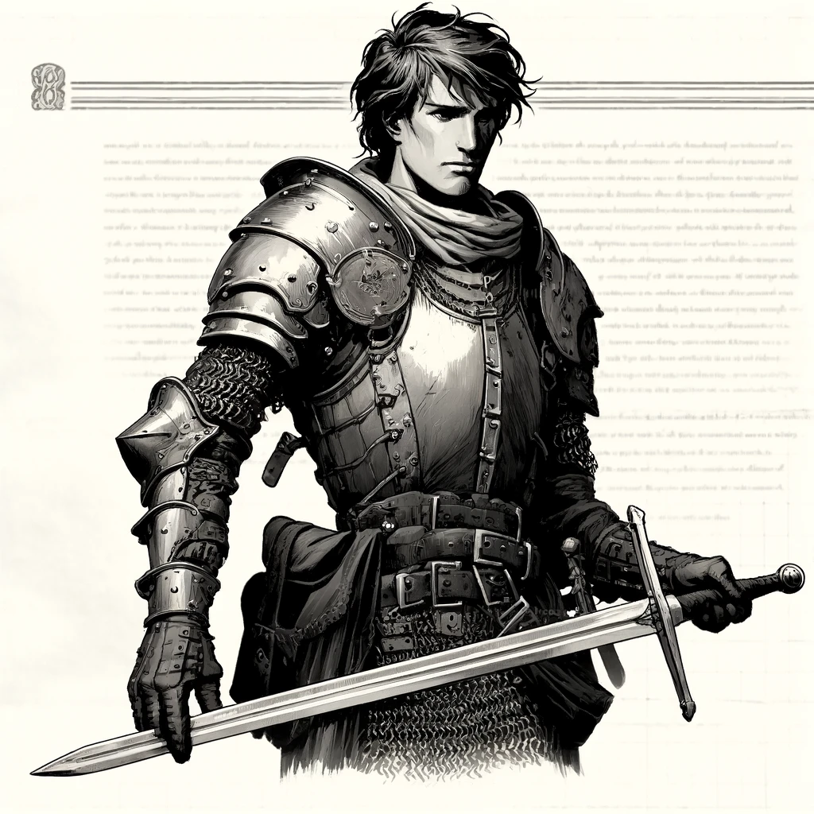

## Modifiche di classe

Init dice: uno sotto  
Saves: Pa -1 , Mfx +1  
Malus delle combat stance: -1   
Dado delle Ferite: 1 sopra 

#### Funnell equipment:

||I roll|II roll|III roll|
|---|---|---|---|
|1|arma media e scudo|heavy cloth armor|10m di corda|
|2|arma grande |soft leather armor||
|3||||
|4||||

## Knight

caratteristica principale: Forza 
- Vantaggio sulle prove di forza fisica in rimozione di un ostacolo.
- BAC modificata dalla costituzione 

#### Lvl 1 Equipment:

||I roll|II roll|III roll|
|---|---|---|---|
|1|scudo grande|pozione di forza||
|2|studded leather armor|||
|3||||

## Swashbuckler

caratteristica principale: Destrezza
- Vantaggio sulle prove di agilità in evasione di un ostacolo.
- BAC modificata dalla destrezza

  
#### Lvl 1 Equipment:

||I roll|II roll|III roll|
|---|---|---|---|
|1||pozione di velocità|1d4 frecce incendiarie|
|2||||
|3||||

## Ranger

template Knight ow Swashbuckler, ma sostituisce il vantaggio con:
- vantaggio sulle prove di foraging e navigation

inoltre:

- Saves: Po -1

  
#### Lvl 1 Equipment:

||I roll|II roll|III roll|
|---|---|---|---|
|1|long bow|frusta||
|2|frusta|neutralizza veleno||
|3||||
|4||||

## Berserker

