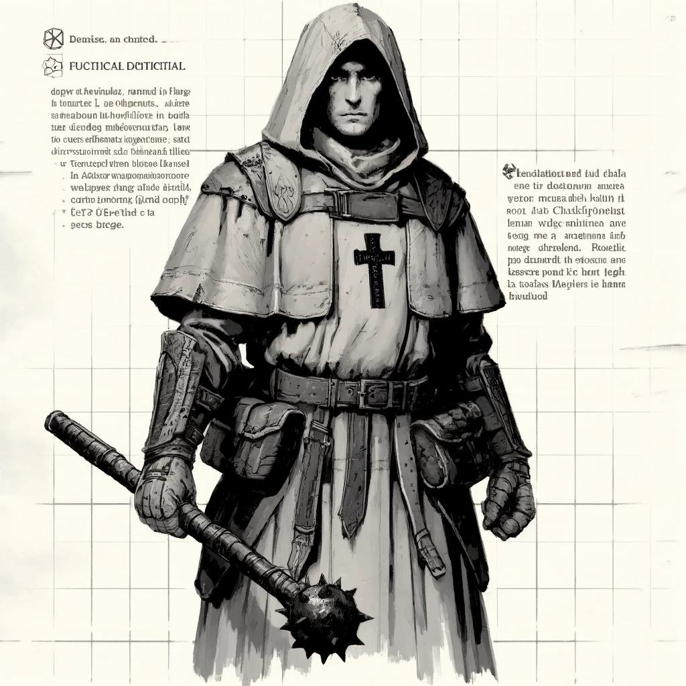

## Modifiche di classe
Saves: Mfx -1

Il chierico ottiene gli incantesimi per grazia divina, può sempre decidere cosa lanciare tra tutti gli incantesimi che conosce ma non ha modo di impararne di nuovi, gli vengono concessi in seguito a quest.

#### Funnel Equipment:

||I roll|II roll|III roll|
|---|---|---|---|
|1|mace|shield|deity symbol|
|2||||
|3||||
|4||||

## Inquisitore

caratteristica principale: Percezione
- Vantaggio all'interpretazione dei motivi altrui

#### 1 Lvl Equipment:

||I roll|II roll|III roll|
|---|---|---|---|
|1|flail||sigil of dispel magic|
|2||||
|3||||
|4||||

## Frate

caratteristica principale: Carisma
- Vantaggio ai tentativi di persuazione non ingannevole

#### 1 Lvl Equipment:

||I roll|II roll|III roll|
|---|---|---|---|
|1|||healing kit|
|2||pozione di guarigione|acquasanta|
|3||||
|4||||

### Equipaggiamento

## Paladin

#### 1 Lvl Equipment:

||I roll|II roll|III roll|
|---|---|---|---|
|1||||
|2||||
|3||||
|4||||

Funnell :

- Arma media
- simbolo sacro
- 10 candele
- armatura leggera o scudo piccolo

Lvl 1:

# Druido